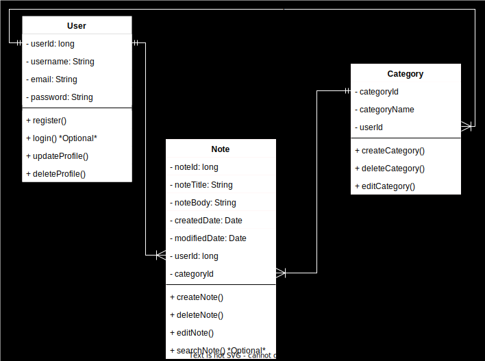

# Project-M295-Note-App
## Quick Idea Summary
I want to maka a Note App that has a **User System** a **Category System** and of course **Taking Notes**:
1. **User System**: Supports user registration, login/logout, and profile management.
2. **Category System**: Allows users to create, edit, and delete categories to organize notes, with filtering options.
3. **Note-Taking**: Users can create, edit, delete, and search notes, with basic formatting options like bold and bullet points.
## Project Criteria

### A: Allgemein - 10 Punkte
- Die Komplexität des individuellen Projektes ist angemessen (mindestens so komplex wie WISS-Quiz).
- Arbeiten sind weitestgehend nach Vorgaben vollständig.
- Abgabe enthält alle verlangten Dateien und ermöglicht den Betrieb.
- Positiver Gesamteindruck des Projektes und der Dokumentation.
- Professioneller Einsatz von GitHub mit angemessener Anzahl sinnstiftender Commits.

### B: Projektdokumentation – 22 Punkte
- Die Dokumentation wurde als PDF-Datei oder GitHub-Markdown abgegeben und nach IPERKA strukturiert.
- Grundidee beschreibt das des Projekts aus Anwendersicht (elevator pitch).
- Arbeitsplan enthält sinnvolle Arbeitspakete und Aufwandsschätzungen.
- Anforderungsanalyse wurde durchgeführt und dokumentiert (mindestens drei User Stories mit Akzeptanzkriterien).
- Klassendiagramm der Modell-Komponenten ist enthalten und korrekt.
- Testplan für manuelles Testen ist vorhanden und beinhaltet je drei sinnvolle Testfälle für Positiv- und Negativtests.
- Testprotokoll wurde geeignet dokumentiert.
- Installationsanleitung ist vorhanden und korrekt.
- Hilfestellungen wurden maßvoll eingesetzt und dokumentiert.
- Die API-Endpunkte sind geeignet dokumentiert.
- Auswerten-Teil enthält selbstkritische Reflexion des Moduls und des Projekts.

### C: Implementierung REST-API - 26 Punkte
- Das Projekt lässt sich ohne Anpassungen in eine IDE importieren.
- Das Projekt lässt sich nach Anleitung ohne Kompilierfehler erstellen und starten.
- Die Java-Klassen beinhalten sinnvolle und korrekte JavaDoc Kommentare (ohne Getter/Setter).
- Die Applikation stürzt nicht ab, Exceptions werden sauber gehandelt.
- Das REST-API bietet geeignete Endpoints für das Laden von Daten an.
- Das REST-API bietet geeignete Endpoints für das Erfassen von Daten an.
- Das REST-API bietet geeignete Endpoints für das Editieren von Daten an.
- Das REST-API bietet geeignete Endpoints für das Löschen von Daten an.
- Daten werden sinnvoll validiert.
- Fehlerhafte Daten werden mit geeigneten Fehlermeldungen abgewiesen.
- Daten werden in einer Datenbank persistent abgelegt.
- Unit-Tests sind vorhanden und beinhalten je drei sinnvolle Testfälle für Positiv- und Negativtests.
- Unit-Tests sind ausführbar 
## User Stories
The User Stories are sorted after the **Priority**
### User Registration:
As a **user**, I want to **create an account** so that i can securely **access my notes**.
#### Acceptance Criteria
- The system **must** accept a **username**, **email**, and **password** for **registration**.
- The system **must** **validate** that the **email and username** is **unique** and **correctly formatted**.
### Edit/Delete User:
As a **user**, I want to **edit or delete my account** so I can keep **my Information up to date** or **delete my Personal information**.
### Create Note:
As a **user**, I want to **create notes** so i can save **important Information**
#### Acceptance Criteria
- The user **must** be able to **enter a title and body** for the **note**.
- The system **must** **save** the **note** and **display it in the user's notes** list.
- The user **must** receive a **confirmation message** upon **successful** creation.
- The system **must** reject **invalid notes** upon note creation.
### Edit/Delete Notes:
As a **user**, I want to **edit or delete notes** to keep my **notes relevant and accurate**.
#### Acceptance Criteria
- The user **must** be able to **edit** the **title and body** of an **existing note**.
- The system **must** **update** the **note** and **reflect changes** in the **notes list**.
- The user **must** be able to **delete a note**, with **a confirmation prompt before deletion**.
- the system **must reject** **invalid notes** upon note creation
### Category Creation:
As a **user**, I want to **create categories** so that I can **organize my notes** by topic.
#### Acceptance Criteria
- The user **must** be able to **create a new category** by entering a name.
- The system **must** **save the category** and **display it in the user's category list**.
- The user **must** receive a **confirmation message** upon successful **category creation**.
### Edit/Delete Categories:
As a **user**, I want to **edit or delete categories** to manage my **Category preferences**.
#### Acceptance Criteria
- The user **must** be able to **edit the name** of an **existing category**.
- The system **must** **update the category name** and **reflect changes in the category list**.
- The user **must** be able to **delete a category**, with a **confirmation prompt** before deletion.
### Filter by Category:
As a **user**, I want to **filter notes by category** so I can **easily find related notes**.
#### Acceptance Criteria
- The user **must** be able to **select a category** to **filter the notes** displayed.
- The system **must** **only show notes** that belong to the **selected category**.
- The user **must** be able to **reset the filter** to **view all notes**.

#### Acceptance Criteria
- The user **must** be able to **update** **their profile** information (username, email).
- The system **must** **validate** the **email** format and ensure the **username is unique**.
- The user **must** receive a **confirmation message** upon **successful profile update**.
## Low Priority / Optional: 
these have no acceptance criteria because they are bonus features that i will implement at the end
### Format Notes:
As a **user**, I want to **format my notes** with bold text, bullet points, and links to **make them clearer**.
### Tagging:
As a **user**, I want to **tag notes** with custom tags for **additional organization**.
### User Login:
As a **user**, I want to **Log in and out** of my account so that only **I can see my Notes**.

## Class Diagramm
With these User Stories i created a Class Diagramm on the most important Classes: 
## Timeplan
if i want to spend more time on a day i'm going to do that 
### Day 2 (Wednesday): User-related endpoints (4 hours)
- [x] **1 Hour**: Set up the development environment and initialize the project repository. 
- [x] **1-4 Hours**: Implement all necessary user-related endpoints (registration, profile editing, and deletion).
### Day 3 (Thursday): Note endpoints (4 hours)
- [x] **1-4 Hours**: Implement endpoints for note creation, editing, deleting, and fetching notes.
### Day 4 (Friday): Category endpoints(4 hours)
- [x] **1-4 Hours**: Implement endpoints for category creation, editing, deleting, and fetching notes by category.
### Day 5 (Saturday): Testing/Unit Testing (4 hours)
- [ ] **1-4 Hours**: Write tests for user-related endpoints (registration and edit/delete).
### Day 6 (Sunday): Testing/Unit Testing (8 Hours)
 - [ ] **5-8 Hours**: Write tests for note and category endpoints.
### Day 8 (Tuesday): Finishing touches
- [ ] **1-8 Hours:** Finalizing the work and optimize the code for the requirements of the project. do some Frontend (Optional)

## Diary
### Wednesday 30.10.2024
I created and imported all necessities of my project and started with the User class. Later i wanted to add Api responses for my UserController class so i can have better responses for my errors and successful creation. I had some spare time so i also finished the Note class. Overall a productive day
### Thursday 31.10.2024
I created the Note class + Controller and ive Noticed that on the return massage on the Post mapping everything of the user is null except the userID so i researched and found DTOs(Data Transfer Objects) so i tried it but it was very difficult but with the Help of ChatGPTS explanations i managed to  do it. At the end it still didn't work and i was disappointed but i still implemented it. It is useful for hiding data u don't want others to see so it wasn't completely useless.
### Friday 1.11.2024
I finished the Category Class with all the necessities like Controller and the DTO. I also did that the data reflected is only showing the userId without the username etc. No issues today
### Saturday 2.11.2024
I only did the Testplan and exception handler today due my limited time but i did the whole Testplan for all endpoints. Tommorow im going to Test it all and also do the Unit Tests. The only issue i had today was, that the Validation worked in a wierd way and i didn't know, that if i want the right error messages i have to Validate the DTO's too but it works now

## Testplan

| Test ID | Test Name                    | Requirements            | Test Type   | Test Process                                              | Expected Outcome                          |
|---------|-----------------------------|-------------------------|-------------|-----------------------------------------------------------|-------------------------------------------|
| 1       | Create Note                  | Valid userId, API access | Positive    | Send a POST request to `/note` with valid noteTitle, noteBody, and userId. | Note is created and saved successfully.   |
| 2       | Create Note without Title    | Valid userId, API access | Negative    | Send a POST request to `/note` with an empty noteTitle.    | Error message: "Title cannot be empty".   |
| 3       | Update Note Title            | Note exists              | Positive    | Send a PUT request to `/note/{id}/notetitle` with a new valid title. | Note title is updated successfully.       |
| 4       | Update Note Title Empty      | Note exists              | Negative    | Send a PUT request to `/note/{id}/notetitle` with an empty string. | Error message: "Title cannot be empty".   |
| 5       | Delete Note                  | Note exists              | Positive    | Send a DELETE request to `/note/{id}`.                    | Note is deleted from the database.        |
| 6       | Delete Non-Existent Note     | Non-existent noteId      | Negative    | Send a DELETE request to `/note/{invalid-id}`.            | Error message: "Note with ID {id} not found". |
| 7       | Create Category              | Valid userId             | Positive    | Send a POST request to `/category` with valid categoryName and userId. | Category is created successfully.         |
| 8       | Create Category without User | Missing userId           | Negative    | Send a POST request to `/category` without userId.         | Error message: "User ID cannot be null".  |
| 9       | Register User                | API access               | Positive    | Send a POST request to `/user/register` with valid data.   | User is registered successfully.          |
| 10      | Register User Invalid Email  | Invalid email format     | Negative    | Send a POST request to `/user/register` with invalid email. | Error message: "Please enter a valid email". |
